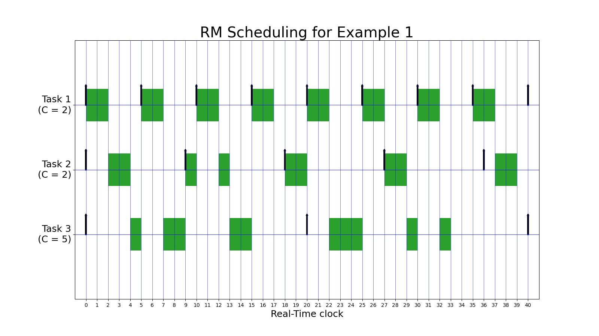

# embedded systems scheduling with python
scheduling task for embedded system with python
### scheduling with Apriodic task:

### ED scheduling:

### RM scheduling:

### DM scheduling:

### DM scheduling:

### RM with resources scheduling:

